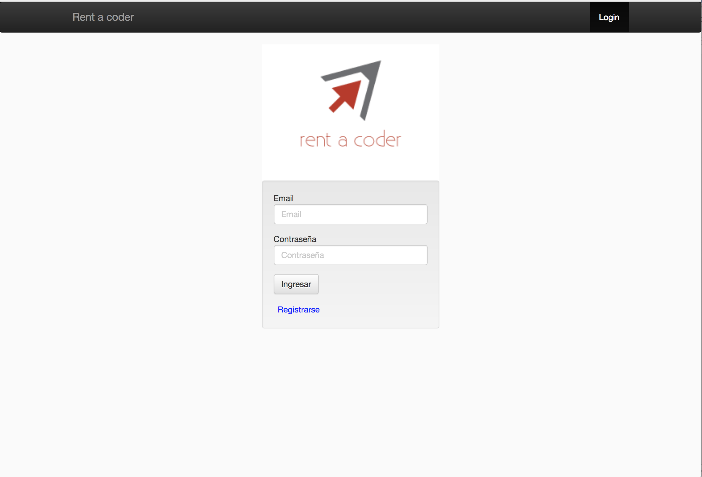
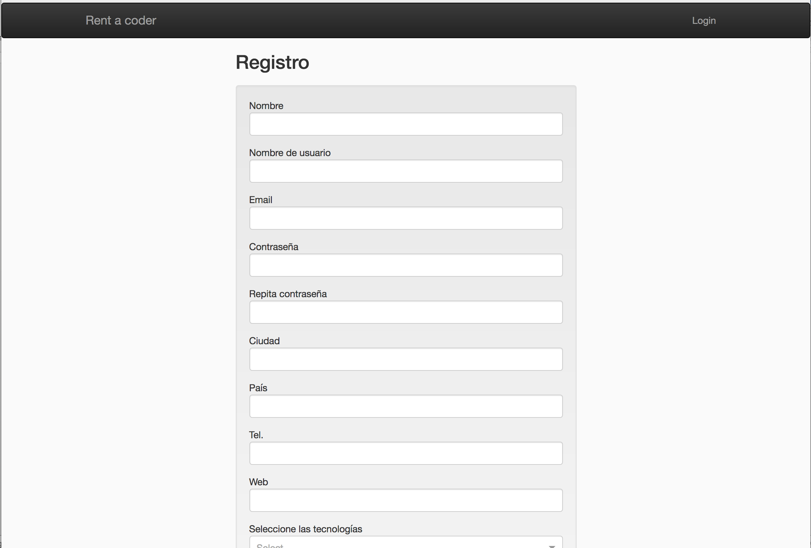
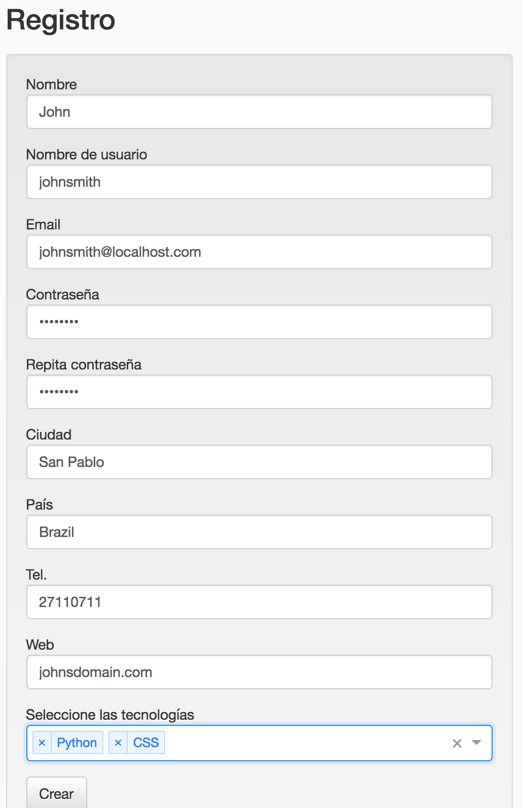
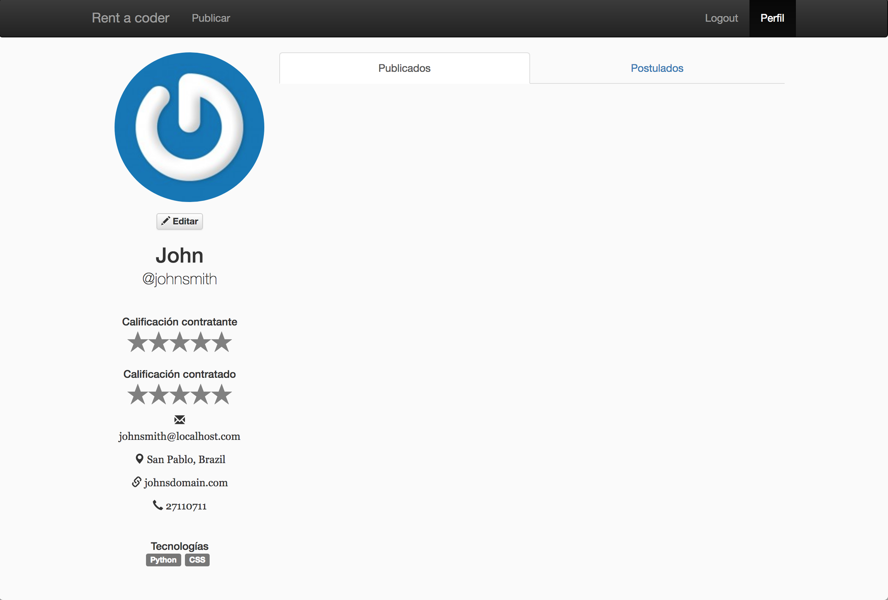
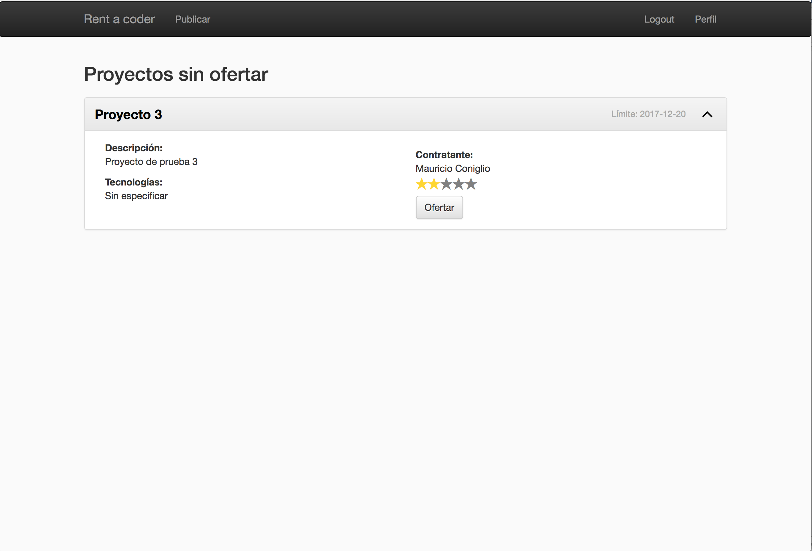
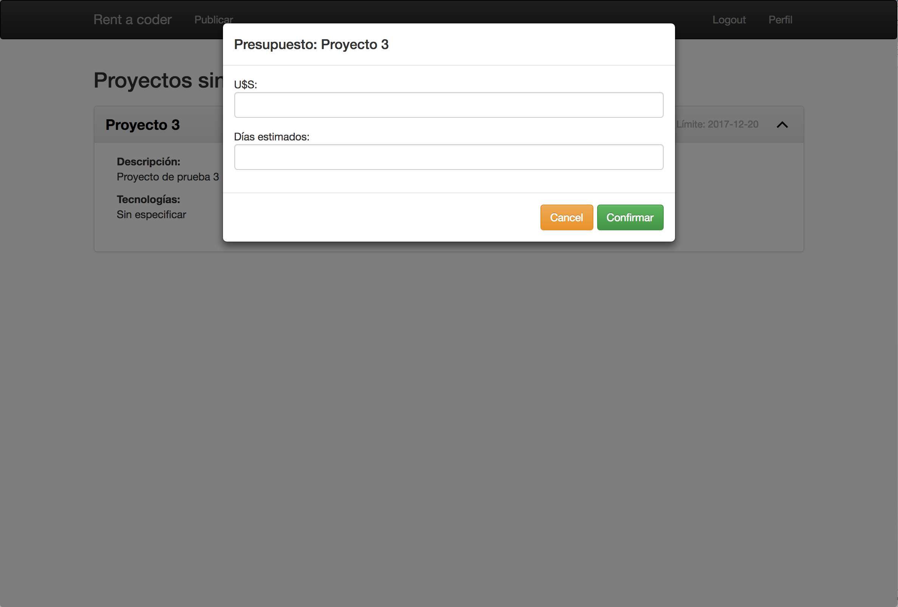
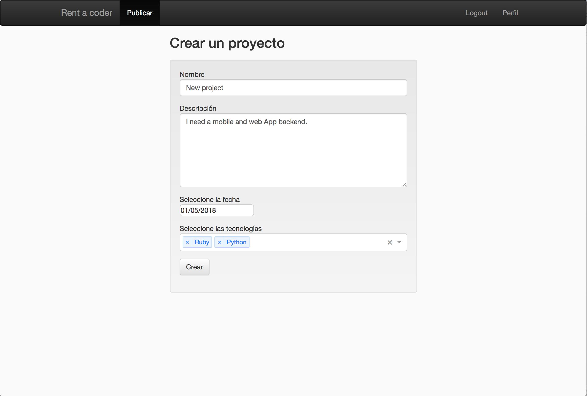
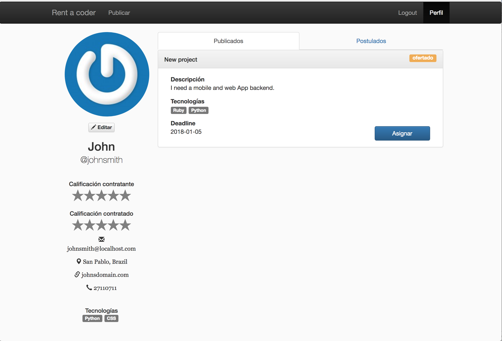
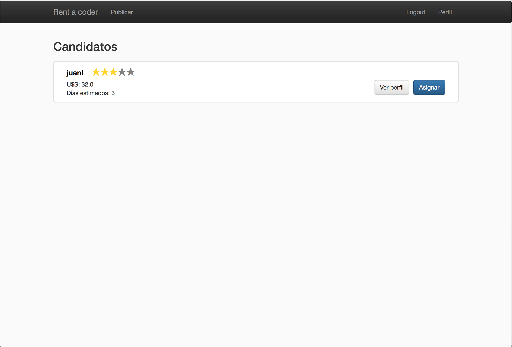

# Rent a coder
This is a project where we try demonstrate our ability with ReactJs.

What we done is web page were you as company can create project and developers can offer to that projects.

## Commands 
If you have Mac you need to run the following command to commit:
```
npm run activateGitLinter
```

To install dependencies and run the project.
```
npm install
npm start
```

## Preview
### Login


### Register




### Profile page

We have 2 reputations. One as developer other as company.


### Projects 

In this page you all projects, that can be offer.


### Create project
In this page you all projects, that can be offer.


### Offer a project


### Create a project


### Someone offer to the created project


### Candidates who offered
